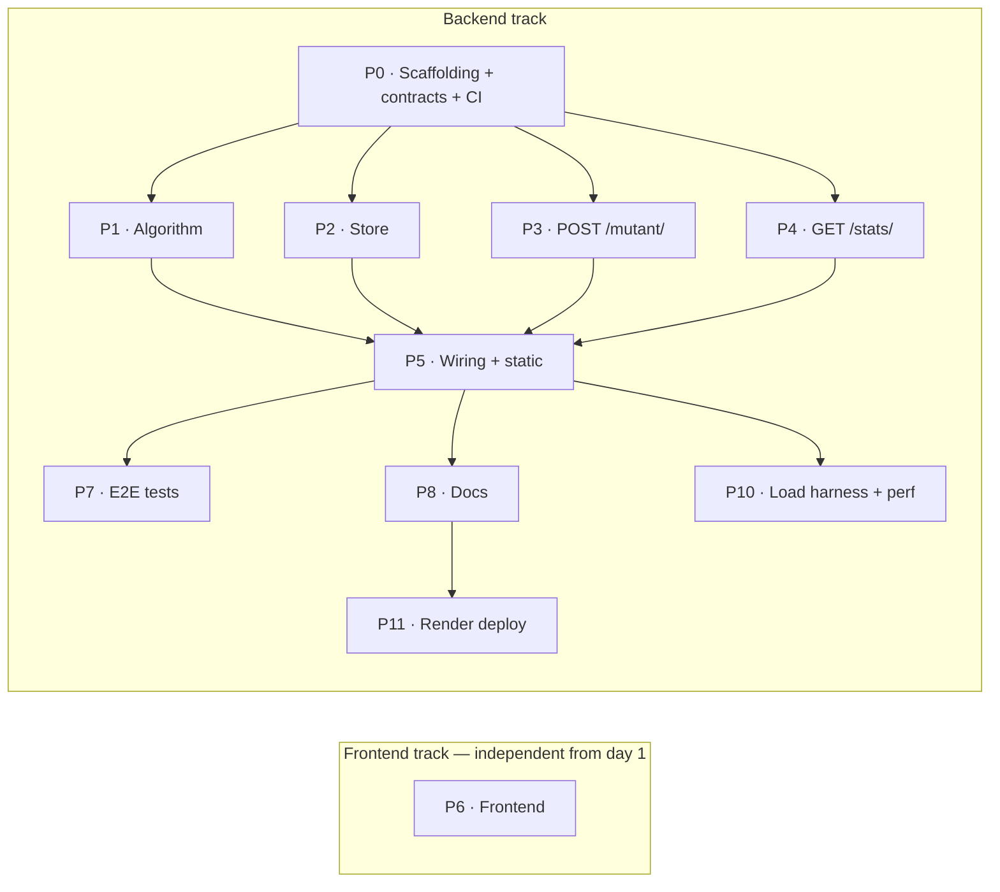

# Implementation Plan — RIF Mutant Detector

Phased delivery of everything in [requirements.md](./requirements.md). **Each phase is one PR.** The
soft target is **~150 lines of changed code per PR** (not a hard rule — cohesive phases that keep code
with its tests win over hitting the number exactly; the algorithm, store, API, and frontend phases
are expected to run larger).

## Conventions

- **One branch + PR per phase** (e.g. `phase-1-algorithm` → PR into `main`).
- **Every PR is green:** `go build ./...`, `go vet ./...`, and `go test -race -cover ./...` pass, **and
  total backend coverage is ≥ 80%** — CI enforces the gate on **every PR**, not just at the end.
- **Coverage is backend-only:** the ≥ 80% rule applies to the Go backend. The frontend (P6) is verified
  manually — no JS test suite (only the BE is tested).
- **Tests ship with the code** they cover — each PR adds the tests that keep it over the line.
- **Phases branch off `main`** as soon as their dependencies are merged — independent phases (see the
  graph) run on **parallel branches**, not in a strict line.
- **Pre-flight for code phases:** before writing Go that touches `modernc.org/sqlite`, `net/http`
  routing, or `httptest`, verify the current API against live docs (training data may be stale).

## Phase dependency graph

**Maximizing parallelism** — two barriers (P0, then P5) with wide fan-out between them:

- **Wave 1 — after P0:** `P1`, `P2`, `P3`, `P4` run in parallel. P0 defines the shared **contracts**
  (`Store` interface, a `Detector` type = `func([]string) bool`, request/response DTOs), so the handlers
  (P3/P4) build against abstractions with fakes — they do **not** wait on the real algorithm (P1) or
  store (P2).
- **Frontend — from day 1:** `P6` has **no backend dependency**; it's coded to the API contract
  (requirements §3) and can start immediately. P5 serves it at runtime; end-to-end verification happens
  once P5 is merged.
- **Barrier — P5:** injects the real algorithm + store into the handlers and mounts every route.
- **Wave 2 — after P5:** `P7`, `P8`, `P10` run in parallel; none depend on each other.
- **P11** follows once `P8` (docs) lands — the deploy note it adds to the README needs `P8`'s wording
  in place before it can point at a live URL.

Peak concurrency: **5 tracks** in Wave 1 (P1–P4 + P6), **3 tracks** in Wave 2.

---

## Phase 0 — Scaffolding & CI
**PR:** `chore: backend scaffolding + CI` · **~170 LOC** · **deps:** none

- **Goal:** a runnable, tested skeleton so every later PR has a green baseline.
- **Covers:** NFR-6, and the **≥ 80% coverage gate** (NFR-3) + CI harness (NFR-5).
- **Adds:** `backend/go.mod` (module + Go version); a **thin** `backend/cmd/server/main.go` (bootstrap
  only — logic lives in tested `internal/` packages) with a minimal `net/http` server, `GET /healthz`,
  config from env (`PORT`), and graceful shutdown; `backend/internal/config`; Go-specific `.gitignore`
  entries (`*.db`, `bin/`); a `README.md` stub; the CI workflow `.github/workflows/ci.yml` — on every
  PR touching `backend/**`, runs `go vet`, `go build`, `go test -race`, and a coverage-threshold gate.
- **Coverage gate (backend, ≥ 80%):** enforced by `.github/workflows/ci.yml` on **every PR** — the
  workflow fails the build under 80%. Coverage is measured over `./internal/...`, so the thin
  `cmd/server` bootstrap is excluded and can't drag the gate down. Mark the **`CI / Test and coverage
  gate`** check *required* in branch protection so sub-80% PRs cannot merge.
- **Contracts (the parallelism enabler):** define `backend/internal/contract` — the `Store` interface,
  a `Detector` type (`func([]string) bool`), and the request/response DTOs. These seams let P1–P4 build
  against abstractions instead of each other.
- **Tests:** `/healthz` returns 200 (httptest); config defaulting.
- **Done when:** `go run ./cmd/server` serves `/healthz`; CI passes.

## Phase 1 — Core algorithm `IsMutant`
**PR:** `feat: mutant detection algorithm` · **~180 LOC** · **deps:** P0

- **Goal:** the pure, efficient detector — the graded core.
- **Covers:** **FR-1** (all sub-points), **NFR-1**.
- **Adds:** `backend/internal/mutant/mutant.go` — `IsMutant(dna []string) bool`: single pass,
  run-length counters across all 4 orientations (horizontal, vertical, ↘, ↙), **early-exit at the 2nd
  sequence**, overlapping windows counted (FR-1.5), bounds-safe on ragged/small input (FR-1.7).
- **Tests:** table-driven — PDF mutant example, verified human `["ATGC","GCAT","TACG","CGTA"]`,
  single-sequence (not mutant), overlap run (`"AAAAA"`), each direction in isolation, `N<4`, empty.
  Target ≥ 90% coverage of this package.
- **Done when:** all vectors pass; `go test -race` green.

## Phase 2 — Storage: interface + SQLite (dedup + counters)
**PR:** `feat: store interface + sqlite backend` · **~200 LOC** · **deps:** P0

- **Goal:** persistence with 1-record-per-DNA and O(1) stats.
- **Covers:** **FR-3**, the data side of **FR-4**, **NFR-2** (O(1) counters behind the P0 interface).
- **Adds:** `backend/internal/store/sqlite.go` — a SQLite implementation of the `contract.Store`
  interface (defined in P0) plus SHA-256 hashing of the normalized sequence: `modernc.org/sqlite`
  (pure Go), schema with **`UNIQUE dna_hash`**,
  `INSERT … ON CONFLICT DO NOTHING` (checks `RowsAffected` for new-vs-dup), in-memory atomic counters
  seeded from a one-time `COUNT` at startup.
- **Tests:** dedup (same DNA twice → 1 row, counters bump once), concurrent `Save` under `-race`,
  stats math, persistence across reopen. Use SQLite `:memory:`/temp file.
- **Done when:** dedup + counters correct under `-race`.

## Phase 3 — `POST /mutant/` + validation
**PR:** `feat: /mutant/ endpoint` · **~200 LOC** · **deps:** P0 *(detector + store injected)*

- **Goal:** the primary endpoint, built against injected abstractions (detector + store).
- **Covers:** **FR-2**, **V-1…V-3**; exposes a handler constructor (route mounted centrally in P5).
- **Adds:** `backend/internal/api/` — a handler constructed with an injected `Detector` and `Store`:
  parse `{"dna":[...]}`, validate (non-empty, **square**, **A/T/C/G** only), run the detector, persist
  via the store, respond **200** mutant / **403** human / **400** invalid / **405** non-POST, small
  `{"mutant":bool}` body (status authoritative). No import of the `mutant`/`store` packages.
- **Tests (httptest):** with a fake detector + fake store — 200, 403, 400 (malformed JSON, missing
  `dna`, non-square, illegal char), 405.
- **Done when:** `curl` gives correct codes; store receives one row per distinct DNA.

## Phase 4 — `GET /stats/`
**PR:** `feat: /stats/ endpoint` · **~140 LOC** · **deps:** P0 *(store injected)*

- **Goal:** usage statistics from the maintained counters.
- **Covers:** **FR-4**.
- **Adds:** `backend/internal/api/stats.go` — a handler with an injected `Store`: read `Stats()`,
  compute `ratio = mutant / human` (**0.0 when human == 0**, FR-4.4), return
  `{count_mutant_dna,count_human_dna,ratio}` (route mounted centrally in P5).
- **Tests:** with a fake store — empty (`0,0,0.0`), counts reflect dedup, ratio math, 405 non-GET.
- **Done when:** stats consistent with the deduped store, served in O(1).

## Phase 5 — Server wiring + static frontend serving + config
**PR:** `feat: assemble server + serve frontend` · **~130 LOC** · **deps:** P1, P2, P3, P4

- **Goal:** one process serving the API + the (soon-to-exist) frontend.
- **Covers:** **FR-5.1**, **NFR-6**.
- **Adds:** a testable `backend/internal/server` constructor that assembles the handler — construct the
  SQLite store (`DB_PATH`), **inject** `mutant.IsMutant` + the store, mount `/mutant/`, `/stats/`, and
  `http.FileServer` at `/` (`FRONTEND_DIR`, default `../frontend`). `cmd/server/main.go` stays a thin
  shell (config → `server` → `ListenAndServe` + graceful shutdown).
- **Tests:** full-stack smoke via `httptest.Server` against the assembled handler (health + `/mutant/` +
  `/stats/`) — exercises the wiring so P5 clears the ≥ 80% gate.
- **Done when:** the whole API runs from `go run ./cmd/server` with env config. (`/` 404s until P6.)

## Phase 6 — Frontend
**PR:** `feat: frontend DNA input UI` · **~200 LOC** · **deps:** none *(independent; served by P5 at runtime)*

- **Goal:** the DNA-input UI — coded to the API contract (requirements §3), buildable from day 1 in
  parallel with the entire backend.
- **Covers:** **FR-5** (all).
- **Adds:** `frontend/index.html` (textarea, one row per line + submit + result area),
  `frontend/app.js` (build `dna[]` → `POST /mutant/` → show **Mutant/Human** from status; surface 400
  messages; fetch + render `/stats/`), `frontend/styles.css` (minimal, hand-written, light/dark-friendly).
- **Tests:** manual verification checklist in the PR — **no JS tests** (only the backend is tested; the
  ≥ 80% coverage gate does not apply to the frontend). Backend integration already covers the API it calls.
- **Done when:** (verified against the running server once P5 is merged) the PDF example shows
  "Mutant"; a human shows "Human"; bad input shows the error.

## Phase 7 — End-to-end integration tests
**PR:** `test: end-to-end integration suite` · **~130 LOC** · **deps:** P5

- **Goal:** cross-cutting coverage that unit tests can't reach — the full request lifecycle.
- **Covers:** **NFR-3** (the ≥ 80% *gate* is already enforced per-PR from P0).
- **Adds:** end-to-end tests spinning the real server against a temp DB — submit → dedup → `/stats/`
  round-trip, invalid-input paths, and persistence across a restart.
- **Done when:** the e2e suite passes under `-race`; the full request→dedup→stats path is covered end-to-end.

## Phase 8 — Docs & optional Dockerfile
**PR:** `docs: readme + deployment` · **~docs + ~30 LOC** · **deps:** P5

- **Goal:** make it runnable + reviewable by anyone.
- **Covers:** **NFR-4** (and surfaces the **NFR-2** scaling narrative).
- **Adds:** `README.md` — overview, build/run/test, `curl` examples for both endpoints, env vars,
  documented decisions (§7 of requirements), and the **scalability narrative** (horizontal scale,
  SQLite→Postgres+Redis scale-path); reference the architecture diagram already in `requirements.md` §10.
  Optional `backend/Dockerfile` (multi-stage) + a one-paragraph deploy note, and a link to
  `loadtest/RESULTS.md` (populated by P10) for performance evidence.
- **Done when:** a clean checkout can build, run, and test from the README alone.

## Phase 10 — Load harness + performance results
**PR:** `perf: load harness + documented results` · **~150 LOC + docs** · **deps:** P5

- **Goal:** real throughput evidence on real hardware — the measurable side of the NFR-2 story.
- **Covers:** **NFR-2** (measured).
- **Adds:** `loadtest/` — a k6 script (alt: `vegeta` targets + shell) hitting `/mutant/` (mutant +
  human payloads) and `/stats/`; a `make loadtest` target (build → run server → fire load → capture
  output); `loadtest/README.md` on how to run and read results.
- **Results:** write `loadtest/RESULTS.md` with a table — req/s, p50/p99, error rate at several
  concurrency levels — captured on real hardware, plus the honest caveat that these reflect one dev
  machine, **not** the horizontally-scaled target, and that 100–1M req/s is the *architectural* design
  goal. The README (P8) links to this file, so P10 doesn't block on P8.
- **Pre-flight:** verify k6 / `vegeta` invocation against current docs before scripting.
- **Done when:** `make loadtest` runs locally; the README has a filled results table + caveat.

## Phase 11 — Render deployment (free tier)
**PR:** `chore: render deploy config` · **~30 LOC + docs** · **deps:** P8

- **Goal:** a free, public live-demo URL for the assembled service — a convenience on top of the
  graded work, not a substitute for it.
- **Covers:** none of the graded `FR-*`/`NFR-*` directly; layers a demo-hosting note on **NFR-6**
  (portability) without altering the graded local/default config.
- **Adds:** `render.yaml` (Blueprint) at the repo root — free-tier web service, `buildCommand`/
  `startCommand` building `backend/cmd/server`, `healthCheckPath: /healthz`, `FRONTEND_DIR=frontend`
  (Render keeps `rootDir` at the repo root so both `backend/` and `frontend/` stay visible to the
  service — differs from the local default of `../frontend`). A short deployment note in
  `requirements.md` and the README (added in P8) documenting the live URL.
- **Documented trade-off:** Render's free tier has no persistent disk, so `mutant.db` resets on idle
  spin-down (~15 min) or redeploy — acceptable for a demo link; does **not** change NFR-6 (the local
  run still needs no external services).
- **Done when:** the Render service builds and serves `/healthz`, `/mutant/`, `/stats/`, and `/` from
  the live URL; the README links it.

---

## Requirements traceability

| Requirement | Phase(s) |
|---|---|
| FR-1 — algorithm | P1 |
| FR-2 — `/mutant/` | P3 |
| FR-3 — persistence + dedup | P2 |
| FR-4 — `/stats/` | P2 (counters) + P4 (endpoint) |
| FR-5 — frontend | P5 (serving) + P6 (UI) |
| V-1…V-3 — validation | P3 |
| Data model (§5) | P2 |
| API contract (§3) | P3, P4 |
| NFR-1 — efficiency | P1 |
| NFR-2 — scalability (design) | P2 (interface, O(1) stats) + P8 (narrative) + P10 (measured evidence) |
| NFR-3 — tests > 80% (backend) | ≥ 80% gate on every PR (from P0) + P7 (e2e) |
| NFR-4 — docs + diagram | P8 (diagram already in requirements §10) |
| NFR-5 — code quality | all phases (conventions) |
| NFR-6 — portability / run | P0 + P5 |
| Throughput evidence (real-hardware load test) | P10 |

## Definition of Done (overall)
Every `FR-*`/`NFR-*` above is satisfied, the [RUBRIC.md](./RUBRIC.md) self-scoring checklist passes,
every PR passed CI's ≥ 80% backend-coverage gate, the app builds/runs/tests
from the README on a clean checkout, and the README includes documented load-test results.
