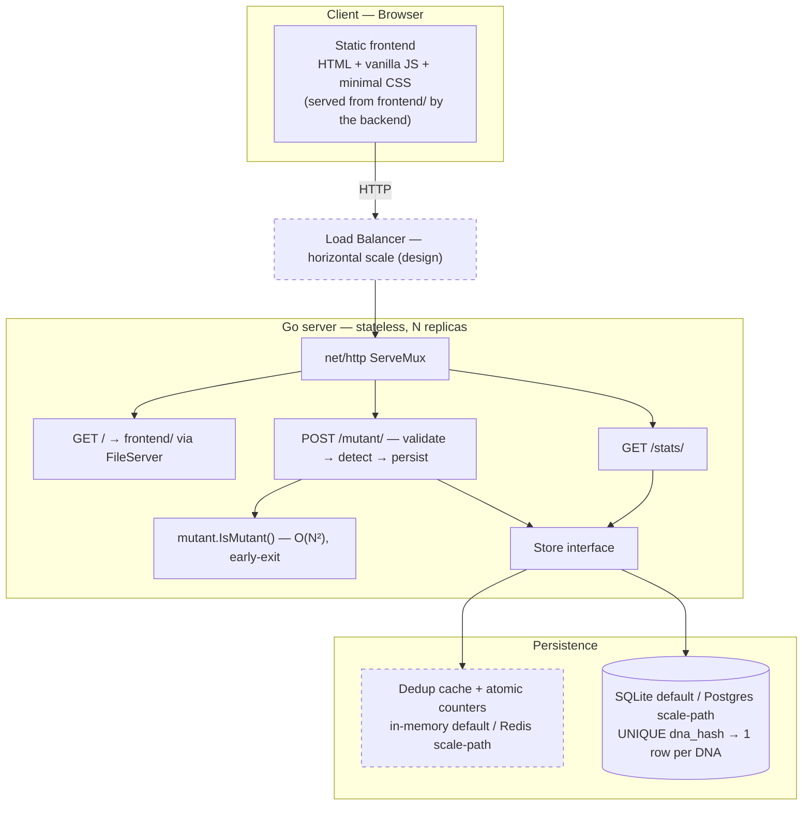
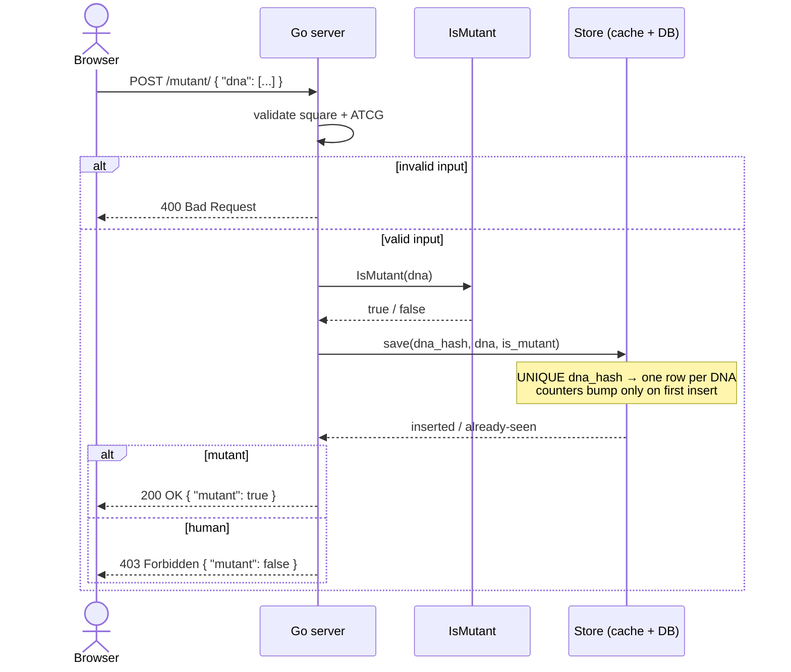

# Requirements — RIF Mutant Detector

High-level requirements for the "Rent It Furnished" technical test: a service that detects whether a
human is a mutant from their DNA sequence, with a REST API, persistence, usage statistics, a
frontend, and supporting docs.

- **Backend:** Go HTTP server (standard library).
- **Frontend:** static HTML + vanilla JavaScript + minimal hand-written CSS, served by the Go
  server.
- **Storage:** embedded SQLite behind a storage interface (with a documented Postgres scale-path).

Requirement IDs (`FR-*`, `NFR-*`) are used so each item is individually testable and traceable to
the rubric (see [RUBRIC.md](./RUBRIC.md)).

---

## 1. Tech stack (locked decisions)

| Concern | Decision | Notes |
|---|---|---|
| Language | **Go** (latest stable; requires ≥ 1.22 for `net/http` method+pattern routing) | Single static binary, near-stdlib |
| HTTP router | Standard library `net/http` `ServeMux` | No web framework |
| Algorithm | Pure Go package, zero dependencies | Unit-testable in isolation |
| Storage | **SQLite** via `modernc.org/sqlite` (pure Go, no cgo), behind a `Store` interface | Postgres/Redis swap documented for scale |
| Frontend | Static **HTML + vanilla JS + minimal CSS** in `frontend/`, served by the backend at `/` via `http.FileServer` | Hand-written `frontend/app.js`, committed to the repo — no framework, no bundler, no build step; served from disk (see §9) |
| Tests | Standard library `testing` + `net/http/httptest`, `go test -cover` | Target > 80% coverage |
| Config | Environment variables (e.g. `PORT`, `DB_PATH`) | 12-factor friendly |
| Docs | `README.md` + Mermaid architecture diagram | Reproducible run instructions |

---

## 2. Functional requirements

### FR-1 — Core algorithm `IsMutant`
- **FR-1.1** Expose a pure function, signature equivalent to `func IsMutant(dna []string) bool`.
- **FR-1.2** Input is an **N×N** matrix: each string is one row; each character is a DNA base.
- **FR-1.3** A **sequence** is **four consecutive identical bases** along a **row (horizontal)**,
  **column (vertical)**, or **either diagonal (↘ and ↙)**. All four orientations must be checked.
- **FR-1.4** The subject is a **mutant** iff the total number of sequences is **greater than one
  (≥ 2)**. A single 4-sequence is **not** a mutant.
- **FR-1.5** **Overlap convention (documented decision):** overlapping windows count independently —
  a run of 5 identical bases contributes 2 sequences, a run of 6 contributes 3, etc.
- **FR-1.6** Detection must **short-circuit**: stop scanning as soon as the second sequence is found
  (see NFR-1).
- **FR-1.7** Degenerate input must not crash: any matrix with `N < 4` cannot be a mutant and returns
  `false`; empty input returns `false`.

### FR-2 — `POST /mutant/` endpoint
- **FR-2.1** Accept `POST /mutant/` with `Content-Type: application/json` and body
  `{ "dna": ["...", "..."] }`.
- **FR-2.2** Return **`200 OK`** when the DNA is a mutant.
- **FR-2.3** Return **`403 Forbidden`** when the DNA is valid but **not** a mutant (human).
- **FR-2.4** Return **`400 Bad Request`** for invalid input — malformed JSON, missing `dna`,
  non-square matrix, or illegal characters *(engineering decision; the PDF only mandates 200/403 for
  valid DNA — see §7)*.
- **FR-2.5** Return **`405 Method Not Allowed`** for non-POST requests to `/mutant/`.
- **FR-2.6** Response body carries a small JSON payload `{ "mutant": <bool> }` for the frontend; the
  **HTTP status code remains the authoritative contract**.

### FR-3 — Persistence & de-duplication
- **FR-3.1** Every **valid** DNA verified through the API is stored. Invalid input (400) is not stored.
- **FR-3.2** **Exactly one record per unique DNA** — resubmitting the same DNA never creates a
  second row and never double-counts in stats (idempotent).
- **FR-3.3** Uniqueness is enforced at the storage layer (UNIQUE key on the DNA hash, with an
  `ON CONFLICT DO NOTHING` upsert), so resubmitting the same DNA never creates a second row.
- **FR-3.4** Each record stores at least: dedup key (hash), the DNA sequence, the `is_mutant` result,
  and a creation timestamp (see §5).

### FR-4 — `GET /stats/` endpoint
- **FR-4.1** Accept `GET /stats/` and return `200 OK` with:
  ```json
  { "count_mutant_dna": 40, "count_human_dna": 100, "ratio": 0.4 }
  ```
- **FR-4.2** `count_mutant_dna` and `count_human_dna` are counts of **distinct** stored DNAs
  (mutant vs human), consistent with the de-duplicated store (FR-3).
- **FR-4.3** **`ratio` = `count_mutant_dna` ÷ `count_human_dna`** — this matches the PDF example
  (`40 / 100 = 0.4`), i.e. mutants-over-humans, **not** mutants-over-total *(documented interpretation
  — see §7)*.
- **FR-4.4** **Divide-by-zero:** when `count_human_dna == 0`, `ratio` is `0.0` (documented convention).
- **FR-4.5** Stats must be cheap to serve under load — derived from maintained counters / indexed
  counts, not a full table scan (see NFR-2).

### FR-5 — Frontend
- **FR-5.1** A single static HTML page served by the Go server at `/`.
- **FR-5.2** Lets the user enter DNA rows (e.g. a textarea, one row per line) and submit.
- **FR-5.3** Calls `POST /mutant/` and clearly displays the outcome — **Mutant** vs **Human** —
  based on the response.
- **FR-5.4** Surfaces validation errors (e.g. the server's `400` message for non-square / illegal input).
- **FR-5.5** Optionally displays live stats by calling `GET /stats/`.
- **FR-5.6** Styling is **minimal, hand-written CSS** — no framework, no CSS build step.
- **FR-5.7** Frontend logic is written in **plain vanilla JavaScript** (`frontend/app.js`,
  committed to the repo) — no framework, no bundler, no build step *(documented decision — see §7
  item 8)*.

---

## 3. API contract (summary)

| Method | Path | Request body | Success | Other statuses |
|---|---|---|---|---|
| `POST` | `/mutant/` | `{ "dna": [".."] }` | `200` mutant · `403` human | `400` invalid · `405` non-POST |
| `GET` | `/stats/` | — | `200` + stats JSON | `405` non-GET |
| `GET` | `/` | — | `200` + HTML page | — |

**Reference vectors** (for tests — see §6):
- Mutant → `["ATGCGA","CAGTGC","TTATGT","AGAAGG","CCCCTA","TCACTG"]` ⇒ `200`, `mutant: true`.
- Human → `["ATGC","GCAT","TACG","CGTA"]` ⇒ `403`, `mutant: false`.
- Too small (`N < 4`) → `["ATG","CAG","TTA"]` ⇒ `403` (cannot be mutant).
- Invalid (non-square) → `["ATGC","CAG"]` ⇒ `400`.
- Invalid (illegal char) → `["ATGX","CAGT","TTAT","AGAA"]` ⇒ `400`.

---

## 4. Validation rules (applied at the API boundary)
A DNA payload is **valid** only if all hold; otherwise `400`:
- **V-1** `dna` is present and is a non-empty array of strings.
- **V-2** The matrix is **square**: every row length equals the number of rows (N×N).
- **V-3** Every character is one of `A`, `T`, `C`, `G` (uppercase only, per the PDF).

Note: `N < 4` is **valid but never mutant** (⇒ `403`), distinct from invalid input (⇒ `400`).

---

## 5. Data model

`dna_records` (one row per distinct DNA):

| Field | Type | Notes |
|---|---|---|
| `id` | integer, PK | Auto-increment |
| `dna_hash` | text/blob, **UNIQUE** | SHA-256 of the normalized sequence — the dedup key (FR-3) |
| `dna` | text | The sequence (rows joined by a delimiter) |
| `is_mutant` | boolean | Cached result, so stats need no recomputation |
| `created_at` | timestamp | Insertion time |

Optional `stats_counters` table (or in-memory atomic counters) maintaining `mutant_count` /
`human_count` for O(1) `/stats/` (NFR-2 / FR-4.5).

---

## 6. Non-functional requirements

### NFR-1 — Algorithm efficiency *(PDF-emphasized: "most efficient way possible")*
- Single in-place scan of the matrix; no repeated copies/transposes.
- Early-exit at the second sequence (FR-1.6).
- Target `O(N²)` time and `O(1)`–`O(N)` extra space.

### NFR-2 — Scalability & burst traffic *(PDF: "consider 100–1M req/s")*
Addressed by **design and documentation** (diagram + README), not a benchmark:
- Stateless HTTP server → **horizontally scalable** behind a load balancer; single small binary.
- Dedup hashing + optional cache to shield the database from repeated writes.
- **O(1) stats** via maintained counters rather than `COUNT(*)` scans.
- Documented **scale-path**: swap the SQLite `Store` for Postgres + a cache/queue (e.g. Redis) with
  the same interface; note the honest trade-off that SQLite is the local/demo choice.

### NFR-3 — Automated tests & coverage *(PDF-emphasized: ">80%")*
- Unit tests for the algorithm across all four orientations plus the edge cases in FR-1 and §6.
- Integration tests (`httptest`) for `/mutant/` (200/403/400/405), `/stats/` math, and dedup.
- **Measured coverage > 80%**, with assertions that test behaviour (no coverage padding).
- **Enforced in CI on every PR** (GitHub Actions) for the **backend** only — a PR under 80% fails the
  check; the frontend is verified manually. *(The workflow is created in plan phase P0.)*

### NFR-4 — Documentation & diagram
- `README.md`: build / run / test instructions reproducible from a clean checkout, plus example
  requests/responses for both endpoints.
- A base **architecture diagram** (Mermaid) showing client → API → cache/counters → DB and the flow
  for both endpoints (see §10).

### NFR-5 — Code quality & structure
- Clear separation of concerns: algorithm ↔ HTTP handlers ↔ storage (distinct packages).
- Idiomatic Go, graceful error handling (no panics on bad input), sensible commit history.

### NFR-6 — Portability & run experience
- `go run` / `go build` works with no external services for the default (SQLite) configuration.
- Configuration via environment variables; sensible defaults.

---

## 7. Assumptions & documented decisions
Judgment calls made where the PDF is silent or ambiguous (each grader-relevant point flagged in RUBRIC.md):

1. **Overlap counting** — overlapping 4-windows count as distinct sequences (FR-1.5).
2. **Ratio = mutants ÷ humans**, per the PDF's `40/100 = 0.4` example (FR-4.3), not mutants ÷ total.
3. **`400` for invalid input** — the PDF only specifies 200/403 for valid DNA; malformed input gets
   400 as sound REST practice (FR-2.4).
4. **`ratio = 0.0` when there are zero humans** (FR-4.4).
5. **Uppercase `A/T/C/G` only** (V-3); other characters are invalid.
6. **SQLite** as the default store, interface-abstracted for a Postgres scale-path (NFR-2).
7. **Small JSON body** on `/mutant/` for the UI, with the **status code authoritative** (FR-2.6).
8. **Frontend language — vanilla JavaScript**: the frontend is hand-written plain JS
   (`frontend/app.js`, committed to the repo) with no framework, bundler, or compile step — the page
   runs from a clean checkout with zero frontend tooling. A strict-mode TypeScript rewrite
   (`frontend/src/app.ts` compiled via `tsc`) was explored on a separate branch and may replace this
   later; until that merges, the committed `app.js` is the source of truth and this document
   describes what is on `main`.

---

## 8. Out of scope
- Authentication / authorization.
- An implemented rate limiter or autoscaler (scaling is addressed as **design** only — NFR-2).
- An actual 1M req/s load test or production infrastructure / IaC.
- A UI framework, app framework, bundler, or frontend build step (React/Vue/webpack/esbuild/Vite/
  tsc/etc.) — the frontend is plain HTML/JS/CSS served as-is (see §7 item 8).

---

## 9. Proposed project structure *(indicative)*

The root contains exactly two code folders — `frontend/` and `backend/` — plus top-level docs.

```
.
├── frontend/                 # static assets — no framework, no bundler, no build step
│   ├── index.html
│   ├── app.js                # hand-written vanilla JS, committed to the repo
│   └── styles.css
├── backend/                  # self-contained Go module (backend/go.mod)
│   ├── cmd/server/           # main(): wiring, config, http.ListenAndServe
│   ├── internal/mutant/      # IsMutant algorithm + unit tests
│   ├── internal/api/         # HTTP handlers: /mutant/, /stats/, static serving
│   ├── internal/store/       # Store interface, SQLite impl, dedup + counters
│   └── go.mod
├── README.md                 # build/run/test + links to this doc
├── requirements.md           # this document
└── .gitignore
```

The backend serves the frontend at `/` from disk via `http.FileServer`, with the directory set by
`FRONTEND_DIR` (default `../frontend`). Note: Go's `//go:embed` cannot reference files outside its
module, so with `frontend/` as a sibling of `backend/` the assets are served from disk rather than
compiled into the binary — an accepted trade-off for the clean two-folder split.

---

## 10. Architecture

Base architecture supporting the design targets in NFR-2. **Solid** elements are the default
local/demo path; **dashed** elements are the horizontal-scale path (documented, not implemented for
the take-home).

### 10.1 Component & request flow



### 10.2 `POST /mutant/` sequence — validation + idempotent dedup



`GET /stats/` reads the maintained counters and returns
`{ count_mutant_dna, count_human_dna, ratio }` in **O(1)** — no table scan (FR-4, NFR-2).

---

## 11. Acceptance criteria
The project is complete when every `FR-*` and `NFR-*` above is satisfied and the self-scoring
checklist in [RUBRIC.md](./RUBRIC.md) passes. The functional core — algorithm (FR-1), both endpoints
(FR-2, FR-4), and dedup persistence (FR-3), all covered by tests (NFR-3) — accounts for the majority
of the grade and is the priority.
